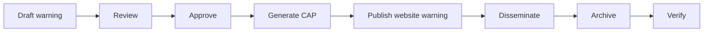

# GMS Digital Service Architecture

> **This is a strategic planning document**, not a codebase architecture guide. It describes the GMS service strategy, product catalogue, and design system framing. For how the code fits together — monorepo structure, auth flow, shared packages, database architecture — see [Technical Overview](./technical-overview.md).

This document holds the strategic service-design framing for Grenada Meteorological Service digital work. It is deliberately broader than the current GrenMet Figma-to-code bridge.

## Current Boundary

`GrenMet` remains the current repo and Figma implementation namespace. `GMS` is the service and product strategy those implementation artifacts support.

This document is not a runtime schema contract. The existing `wxproducts` schema (now part of `admin-gms` after the 2026-06 consolidation) already provides product-metadata, impact-based forecasting, and CAP foundations. A later schema-design pass should reconcile those working foundations with this broader GMS service catalogue before runtime interfaces change.

## Service Framing

GMS should be designed as a national digital meteorological service system, not only as a weather website.

The service architecture has four major layers:

1. **Brand Identity**: logo, color, typography, tone, trust, and authority.
2. **Design System**: reusable UI, content, warning, map, dashboard, PDF, social, and handoff patterns.
3. **Service Catalogue**: the capabilities GMS provides to the public, operators, partners, and sectors.
4. **Product Catalogue**: the forecasts, warnings, bulletins, graphics, datasets, APIs, reports, and dashboards produced by those services.

The service catalogue gives the design system its purpose. The product catalogue gives it structure.


The guiding promise is:

> Clear weather intelligence for public safety, national planning, aviation, marine operations, climate services, and sector-specific decision-making.

## Brand Identity Direction

The provided logo PNG references support a service identity that is official but not cold, Caribbean but restrained, scientific but understandable, and calm by default until hazards require urgency.

Logo roles:

| Role | Use |
| --- | --- |
| Horizontal primary logo | Public and digital interfaces where the service name must read clearly |
| Compact icon or mark | Favicon, app icon, social avatar, compact dashboard surfaces, and map watermark use |
| Roundel or seal | Formal bulletins, certificates, reports, and institutional applications |
| Reverse marks | Dark surfaces and photo backgrounds where the service mark needs contrast |

Use the PNGs as design evidence for role and placement guidance only. They are not the canonical source for brand-color sampling. Canonical values should be audited from original vector or source artwork before current token values change.

## Design System Lanes

The GMS design system should grow beyond generic primitives while keeping a reusable core:

| Lane | Purpose |
| --- | --- |
| Core UI | Buttons, cards, badges, alerts, form controls, navigation, tables, dialogs, states |
| Public Weather | Current conditions, forecasts, summaries, explanatory content |
| Warning and IBF | Banners, warning detail, impact matrix, action language, status and validity |
| Tropical Cyclone | Outlooks, advisories, local impact bulletins, key messages |
| Marine and Aviation | Sector cards, briefs, coded products, operational summaries |
| Maps and Geospatial UI | Warning polygons, legends, stations, marine zones, basemap hierarchy |
| Dashboards and Operations | Editors, approvals, archives, dissemination logs, verification |
| PDF and Bulletin Templates | Official forecast, warning, briefing, and report layouts |
| Social and Education | Public graphics, explainers, preparedness content |
| Developer Handoff | Tokens, component APIs, content contracts, CAP and structured-data mapping |

## Recommended V1 Scope

GMS should not build every strategic service at once. The realistic v1 digital service scope is:

1. Public Weather Service
2. Warning and Impact-Based Forecasting Service
3. Tropical Cyclone Service
4. Marine Weather Service
5. Aviation Meteorological Service
6. Data and Digital Weather Service

Priority v1 product families:

| Service | Initial products |
| --- | --- |
| Public Weather | Daily Public Forecast, 3-Day Forecast, Current Conditions, Weather Graphic Card |
| Warning and IBF | CAP Alert, rainfall and flood advisories/watches/warnings, High Wind products, Severe Weather Bulletin, Impact Matrix, Key Messages Graphic |
| Tropical Cyclone | Tropical Weather Outlook, Special Tropical Weather Outlook, Tropical Cyclone Public Advisory, Local Impact Bulletin, Key Messages Graphic |
| Marine | Marine Forecast, Small Craft Advisory, High Surf Advisory, Swell and Sea State Forecast |
| Aviation | METAR, SPECI, TAF, Aerodrome Warning, Aviation Weather Briefing |
| Data and Digital | Public Website, internal product editor, CAP export, archive, observation dashboard, API-ready structured data |

## Strategic Service Catalogue

The full catalogue is a strategy reference. It can be phased, revised, and governed before every service becomes a product surface.

For full service definitions, product tables, purpose statements, risk frameworks, and implementation notes, see **[GMS Service and Product Catalogue](./service-catalogue.md)**.

| Service | Primary scope |
| --- | --- |
| Public Weather Service | Routine public forecasts, current conditions, explainers |
| Warning and Impact-Based Forecasting Service | Advisories, watches, warnings, impact products, CAP dissemination |
| Tropical Cyclone Service | Disturbance monitoring, cyclone advisories, local impacts, seasonal review |
| Aviation Meteorological Service | Aerodrome observations, forecasts, warnings, briefings |
| Marine Weather Service | Coastal and offshore forecasts, sea state, surf, small craft and port support |
| Climate Service | Summaries, normals, outlooks, drought, data quality |
| Agriculture Weather Service | Farmer outlooks, dry-spell and heat guidance, agrometeorological bulletins |
| Hydrometeorological and Flood Support Service | Rainfall monitoring, flood guidance, landslide and post-event support |
| Disaster Risk and Emergency Management Support Service | Agency briefings, decision timelines, triggers, review |
| Health Meteorology Service | Heat, dust, UV, respiratory and vector-risk weather guidance |
| Tourism and Events Weather Service | Beach, cruise, resort, festival, and event weather support |
| Data and Digital Weather Service | APIs, feeds, portals, archives, digital dashboards, dissemination |
| Education and Outreach Service | Preparedness, schools, explainers, public education |
| Observation and Monitoring Service | Stations, AWS, rain gauges, SYNOP, METAR, quality control |
| Forecast Verification and Quality Service | Accuracy, warning lead time, false alarm and missed-event review |
| Partner and Stakeholder Briefing Service | Recurring briefings for emergency, aviation, government, utilities, media, tourism, agriculture, and marine partners |

## Strategic Product Catalogue

Products are how services become repeatable decisions, content, data, and workflows. This catalogue is a reference set, not a build order. See [GMS Service and Product Catalogue](./service-catalogue.md) for the detailed per-service product tables.

| Service area | Product catalogue reference |
| --- | --- |
| Public Weather | Daily, 3-Day, 5-Day, and parish forecasts; morning, midday, evening, and weekend summaries; current conditions; forecast graphics; key messages; explainers |
| Warning and IBF | CAP alerts; heavy rainfall, flash flood, high wind, thunderstorm, and lightning products; severe and multi-hazard bulletins; impact matrix; affected-area map; preparedness, updates, cancellations, all-clear, review |
| Tropical Cyclone | Tropical outlooks; disturbance notes; cyclone advisories and discussions; watch and warning bulletins; hazardous-wind, rainfall, storm-surge, marine, and key-message graphics; briefings and reports |
| Aviation | METAR, SPECI, TAF, trend forecasts, aerodrome warnings, wind shear and visibility alerts, aviation briefings, pilot packs, airport and ATC updates, incident and climatology reports |
| Marine | Coastal and offshore forecasts; small craft, surf, swell, sea-state, coastal flooding, port, ferry, fisherfolk, yachting, and dive products |
| Climate | Monthly and annual summaries; rainfall, temperature, drought, seasonal outlooks, normals, extremes, data-request reports, metadata and quality reports |
| Agriculture | Agrometeorological bulletins, farmer rainfall outlooks, dry-spell, irrigation, spraying, harvest, livestock heat, pest-risk, soil moisture, SMS or WhatsApp forecast products |
| Hydromet and Flood | Rainfall dashboards, heavy-rainfall outlooks, flash-flood guidance, urban-flood and landslide outlooks, accumulation maps, basin summaries, return-period and verification reports |
| Emergency Management | Agency briefings, decision timelines, confidence and scenario briefings, EOC updates, situation-report input, trigger matrices, escalation briefs, post-event review |
| Health Meteorology | Heat-health, heat-index, Saharan dust, air-quality, dengue or mosquito risk, UV, respiratory, public-health climate, and vulnerable-group advisories |
| Tourism and Events | Tourism outlooks, beach and dive forecasts, event and festival advisories, cruise and resort briefs, lightning risk, beach-safety graphics |
| Data and Digital | Weather API, CAP feed, observation and climate portals, product archives, public and internal dashboards, dissemination workflow, verification dashboard, documentation and machine-readable feeds |
| Education and Outreach | School packs, preparedness guides, warning explainers, IBF and CAP explainers, tropical, marine, and dust education, social cards, webinars, presentations |
| Observation and Monitoring | Conditions reports, hourly observations, SYNOP, METAR, station dashboards, rain-gauge dashboards, station-health and missing-data reports, QC and summaries |
| Forecast Verification and Quality | Daily verification, rainfall and warning verification, tropical, marine, and aviation reviews, user feedback, audits, post-event and annual performance reports |
| Partner and Stakeholder Briefing | NDEMA, airport, ATC, Cabinet, ministries, utilities, media, tourism, agriculture, marine, and situation-awareness briefings |

## Draft Warning Model

This warning architecture is a draft operational model pending GMS leadership and stakeholder approval. Thresholds, terminology, matrices, governance, and operational duties must be approved before they become runtime rules.

### Product Timing

| Term | Draft meaning | Time relationship |
| --- | --- | --- |
| Outlook | Possible risk in coming days | Usually 2 to 7 days ahead |
| Advisory | Lower-level hazard or early concern | Often now to 72 hours |
| Watch | Hazardous conditions are possible | Preparedness phase before onset |
| Warning | Hazard expected, occurring, or imminent | Near-term or active threat |
| Update | Existing product changed | During valid period |
| Cancellation | Hazard no longer expected | Before original expiry |
| All-clear | Hazard has passed | After event |

Risk framing should keep distinct dimensions visible:

- Impact and likelihood describe how serious the risk is.
- Urgency or time-to-onset describes how soon users must act.
- Duration describes exposure.
- Confidence describes remaining uncertainty.

Warning communication should never rely on color alone. A warning needs a level label, hazard name, response text, iconography or other visual cue, validity, and source. Use color as a paired reinforcement for level/status, not as the only carrier of meaning.

### Warning Content Contract

Every official warning direction should account for:

1. Headline
2. Hazard and warning or response level text
3. Affected areas
4. Impact and likelihood
5. Valid period, issue time, update time, and current status
6. Source and contact or attribution
7. What to expect
8. What to do or recommended actions
9. Confidence and next update

### CAP-Aware Direction

The warning workflow should remain CAP-aware:



| GMS UI field | CAP field direction |
| --- | --- |
| Headline | `headline` |
| Description | `description` |
| Recommended actions | `instruction` |
| Severity | `severity` |
| Certainty | `certainty` |
| Urgency | `urgency` |
| Affected areas | `areaDesc` and geometry fields |
| Effective, onset, expiry | CAP timing fields |
| Source | sender attribution fields |

## Product Metadata Direction

The most important future product-spec field is the user decision the product exists to support. The following concept is architecture direction only, not a committed runtime interface:

```ts
type GMSProductDirection = {
  id: string;
  name: string;
  productCode: string;
  serviceArea: string;
  audience: string[];
  primaryUserDecision: string;
  purpose: string;
  issueSchedule: string;
  validPeriod: string;
  trigger: string;
  disseminationChannels: string[];
  priority: "routine" | "advisory" | "watch" | "warning" | "emergency";
  contentSections: string[];
  capMapping?: Record<string, string | string[]>;
  archiveRequired: boolean;
  verificationMethod?: string;
  owner: string;
  status: "proposed" | "draft" | "approved" | "active" | "retired";
};
```

## Governance

| Role | Responsibility |
| --- | --- |
| Meteorological leadership | Approves warning levels, thresholds, terminology, and service direction |
| Duty forecasters | Use products operationally and validate workflows |
| Product and design lead | Maintains system guidance, templates, and design-system decisions |
| Frontend and backend developers | Implement components, structured products, APIs, publishing, and archives |
| Communications officer | Reviews public language and multi-channel content |
| Emergency, aviation, marine, and sector partners | Validate action language and operational usefulness |

## Roadmap

| Phase | Deliverables |
| --- | --- |
| 1. Foundations | Logo system, color tokens, typography, spacing, grid, icon direction, accessibility rules |
| 2. Core UI kit | Buttons, cards, badges, alerts, navigation, tables, forms, tabs, dialogs, empty/loading/error states |
| 3. Weather components | Current conditions, forecasts, warning banner, CAP card, marine card, aviation panel, observations, timestamps, legends |
| 4. Warning and IBF system | Warning levels, impact matrix, advisory/watch/warning logic, detail page, CAP mapping, notifications |
| 5. Product templates | Homepage, forecast, warning, marine, aviation, data pages, PDFs, social graphics, dashboards |
| 6. Digital operations | Product editor, approvals, CAP export, archive, observation dashboard, dissemination logs, verification |
