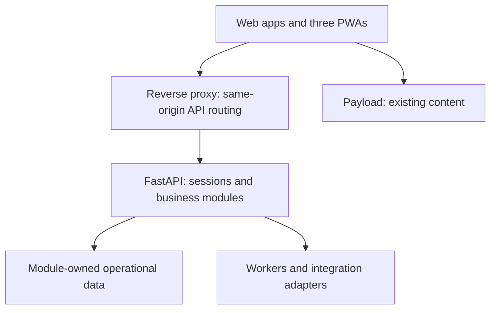

# GAA modular platform: product roadmap and implementation guide

**Status:** Working plan  
**Owner:** GAA (institutional content); maintained by Barrels Grenada  
**Last updated:** 2026-09-17

**Recorded:** 2026-09-16. **Status:** User-directed planning baseline; application implementation and operational rollout are not authorised by this document.

## Purpose and authority

Make everyday GAA work simpler and more reliable through a modular airport platform. Grow toward comprehensive airport management by building core workflows and integrating useful specialist systems selectively. Comprehensive scope is a destination, not a commitment to replace every specialist system.

This guide implements the [client programme](../portfolio/gaa-gms-client-programme-plan.md), with ownership defined by the [delivery map](../portfolio/repository-delivery-map.md). GMS weather services and GAA staff/airport operations remain distinct programmes sharing infrastructure. Barrels products remain separate. Existing safety, warning, aviation and observation obligations take precedence over discretionary migration work.

## Confirmed decisions

- Deliver shared foundations, Janitor, Bus, then the GMS PWA; follow with IT service desk and initial PIMU requisitions, then wider GAA workflows. Preserve existing GMS website functionality alongside its separate PWA.
- Pilot each workflow with its relevant MBIA team, then expand to Lauriston. Do not require cleaners or drivers to pilot through Meteorology; existing HR/GMS pilots remain valid.
- Use linked departmental workflows: departments own their records and actions; authorised users see progress across linked work. Avoid one generic form record for every domain.
- Begin broader airport management with operational records and coordination; introduce live/specialist integrations only after confirming owners, interfaces and need.
- FastAPI owns custom business rules, permissions and operational records. FastAPI is also the target for browser-facing authentication and API operations; Hono is deferred. Web apps/PWAs own presentation and interaction. Payload retains its existing CMS responsibilities.
- Keep personal and work accounts separate, with no initial account linking. Each account can use shared sign-in across permitted applications. Public registration grants no staff access.
- An administrator confirms staff status. Role-based defaults produce explicit application grants, with individual exceptions. Department scope never automatically grants sensitive case access.
- Sensitive HR cases are restricted to designated handlers and explicitly authorised participants.
- Support cross-domain sign-in, site-local logout and a separate logout-all action. Existing shared-parent cookies alone do not fulfil cross-domain sign-in.
- PWAs support reading previously loaded permitted data. All mutations require connectivity. Cache only essential private work information, with expiry and logout clearing; passenger manifests stay online initially.
- Conflicting source rules require confirmation by the responsible GAA owner before activation. Unaffected work continues.

The user clarified that the transport memo's prohibition on reserving seats means holding seats for others; official app bookings are authorised in the intended workflow. Record this as user-confirmed interpretation, not as an independently verified amended institutional document.

## Product surfaces

| Surface | Initial responsibility | Later extension |
| --- | --- | --- |
| GAA Admin | Staff administration, department queues, configuration, dispatch, supervisory work | PIMU, service requests, assets, safety and operations |
| Janitor PWA | Cleaner assignments and supervisor assignment/reassignment/progress | Inspection-linked work after pilot |
| Bus PWA | Staff journeys, bookings, authorised trip/boarding operations, existing parking-permit access | Fleet/service improvements after evidence |
| GMS website | Existing public weather and editorial experience | Existing GMS programme |
| GMS PWA | Forecasts, warnings, available observations and links to website articles | Approved public-service improvements |
| MBIA website | Passenger information | Selected passenger and commercial requests |
| Auth | Personal/work account sign-in, recovery and sessions | Confirmed identity integrations |
| Payload | Existing editorial content and media | No wider replacement or expansion assumed |

Public weather remains anonymous to read. Personal accounts support selected existing per-app preferences. Newsletters, subscriptions and marketing delivery are deferred. Work-account invitation versus request flow, contractor onboarding and leaver administration were asked about but not answered; they remain open decisions.

## Capability backlog

IDs below identify planning capabilities, not implemented features. Each delivery slice needs a named delivery owner and institutional acceptance owner before starting.

| ID | Capability and minimum useful journey | Placement / dependency | Acceptance measure |
| --- | --- | --- | --- |
| GAA-01 | Access: verified worker receives correct app and department scope | Identity; prerequisite for private workflows | Positive and negative access scenarios pass |
| GAA-02 | Cleaning: supervisor selects catalogue tasks, dates and one named cleaner; cleaner completes or reports blocked work | Facilities; Janitor PWA | Assign, reassign, complete and overdue history remain attributable |
| GAA-03 | Transport: dispatch publishes verified dated trips; eligible staff book/cancel; operator records boarding/departure | Transport; roster eligibility interface | No overbooking or boarding that consumes protected reservations |
| GAA-04 | Parking: apply, renew and track existing permit/decals | Existing HR permit workflow | Approval, replacement and expiry remain traceable; no space-booking feature |
| GAA-05 | Weather: publish approved products to website and PWA | Existing GMS product/CAP programme | Same approved issue on both surfaces; expiry/withdrawal visible |
| GAA-06 | IT support: create request, assign, reply, resolve/reopen | Service requests; documents/audit | Private notes never leak into requester responses |
| GAA-07 | PIMU requisitions: draft line items, submit, review, return or approve | PIMU; confirmed approval matrix | Submission survives refresh; duplicate retries do not duplicate requests |
| GAA-08 | Procurement/inventory: quotes, PO references, partial receipt, issue, return and correction | PIMU; GAA-07 | Stock movements reconcile; PO creation never claims delivery |
| GAA-09 | Equipment/key custody: issue or loan, acceptance, return and overdue follow-up | Assets; staff and inventory interfaces | Named custodian and complete movement history |
| GAA-10 | Inspections/maintenance: VIP or facility inspection, defect, work order, repair and verification | Facilities; links to PIMU/assets | Finding remains linked to corrective work and closure evidence |
| GAA-11 | Workforce: strengthen existing leave, roster, absence, exchange, timesheet and training journeys | Existing HR; approved policies | Representative duty cycles and approval exceptions pass UAT |
| GAA-12 | Safety: hazard/incident, triage, investigation, actions and closure | Restricted safety module | Only authorised roles see case details; actions have owners |
| GAA-13 | Airport operations: daily status, facility log, shift handover, aircraft movement records | Operations; airport/location registry | Next shift inherits unresolved obligations without losing history |
| GAA-14 | Emergency readiness: approved phase checklist, readiness reports, situation log, recovery actions and exercises | Operations; approved plan/version | Exercise records decisions and outstanding actions; no automatic airport closure/reopening |
| GAA-15 | Security passes: application, review, issue, expiry, loss and revocation | Security; separate from parking | Pass lifecycle and authorised access are auditable |
| GAA-16 | Commercial services: concession, filming, cold storage, extra hours and premises inspection requests | External request surface + staff module | Applicant can track request; charges/approvals use confirmed policy |
| GAA-17 | Restricted people cases: complaint, harassment or health-related case | Segregated HR case access | Department hierarchy alone cannot expose the case |
| GAA-18 | Passenger services: assistance guidance, feedback and tour evaluation | MBIA | Clear routing, accessible information and accountable follow-up |
| GAA-19 | Controlled documents: source, version, approval, review and acknowledgement | Shared capability with per-record access | Users can identify approved/current material and its owner |

GAA-06–09 lead the wider feature expansion. GAA-10–14 follow as operational coordination matures. GAA-15–18 need separate discovery and acceptance. Document provenance starts immediately; a full document-control product is incremental. Attendance, payroll, live flight/resource optimisation and access-control hardware are not implied first-release commitments.

## Linked workflow example

An inspection identifies a broken light. Facilities creates a defect and Maintenance owns the repair. If a replacement is needed, Maintenance links a PIMU requisition. PIMU tracks approval, procurement and issue; receipt alone does not complete the repair. Maintenance records the repair and the authorised inspector verifies closure.

Keep stable references, actor/timestamp history and permission-filtered progress across these records. Each module validates its own state transitions. Notifications are consequences of committed changes, with retry/deduplication; they are not the source of truth. Do not expose confidential attachments merely because a related record is visible.

## Architecture and package guide

Use `apps/api/fastapi` for custom backend migration. The `apps/api/honoapi` stub was retired on 2026-09-23 ([ADR-0015](../adr/0015-retire-hono-python-backend.md)); PWAs call FastAPI directly. Choose new PWA paths during the first implementation scope. pnpm manages TypeScript packages; uv remains responsible for Python. A monorepo does not require one language or one package manager for all runtimes.

Within a backend module, separate HTTP handlers from application operations, domain rules and persistence/integration adapters. A business operation receives an actor and explicit inputs, not a FastAPI request. Other modules use a small supported interface, not another module's ORM tables. Do not introduce abstractions without a concrete use case.

FastAPI owns browser session validation, business authorisation and response composition. The existing reverse proxy provides same-origin API routing where practical. Framework-specific rendering adapters may forward credentials to a trusted backend, but must not own authentication policy. Existing Next.js session-exchange adapters remain until a tested FastAPI browser-session replacement includes CSRF protection, expiry, revocation and logout semantics. Cross-domain SSO requires a separate standards-based design; cookie sharing is not sufficient for unrelated domains.

| Area | Intended change |
| --- | --- |
| `packages/auth` | Separate framework-independent utilities from Next/React adapters; design cross-domain sessions before rollout |
| `packages/api-client` | Preserve generated OpenAPI contracts; expose transport/types independently from optional React Query hooks |
| `packages/ui` | Keep neutral presentation primitives and accessibility; no backend policies |
| `packages/gms` | Keep brand/presentation; move authoritative operational rules to backend ownership with parity checks |
| Web-owned Drizzle operations | Transfer each custom business module and its migrations to backend ownership; remove the old writer after verification |
| Payload | Preserve database, content and editorial roles; narrowly adapt login eligibility to explicit CMS grants |
| SURFACE, WIS2 and collectors | Preserve independent lifecycles; use owned integration contracts instead of blanket conversion |

Retain current database separation during initial migration. Database consolidation requires an explicit amendment to ADR-0003 and migration/recovery evidence. One module has one authoritative writer and migration owner at a time. Cross-database workflows need explicit consistency/retry handling; do not assume an atomic transaction across them. Development data may be disposable, but that is not authorisation to delete source documents or institutional history.

## Delivery milestones

| Milestone | Deliverable | Dependencies and exit gate |
| --- | --- | --- |
| M0: baseline | Source/conflict register, current journey inventory, module/data ownership, access matrix and representative designs | Identify owners and unresolved rules; classify implemented/proposed/unverified separately |
| M1: foundation | One existing private journey using FastAPI browser sessions, app grants, session contract, clean API-client exports | Cross-domain sign-in and logout design reviewed; access, revocation and errors tested; no mass route switch |
| M2: Janitor | Transfer catalogue access; implement dated assignments and Janitor PWA | Supervisor and cleaner pilot at MBIA; offline permitted reads, reassignment and blocked work verified |
| M3: Bus | Verified timetable, dated trips, dispatch/booking/boarding and Bus PWA | Dispatch confirms conflicting times, holidays and capacity; concurrent last-seat and departure rules pass |
| M4: GMS | Transfer remaining custom weather ownership in small slices; separate GMS PWA consuming shared approved products | Preserve revisions, publication snapshots, withdrawal, audit and existing website; operational owner accepts |
| M5: staff requests/PIMU | IT request-to-resolution and requisition-through-review, then procurement/inventory/assets | Follow existing PIMU plan; do not retire osTicket before complete migration and email-continuity rehearsal |
| M6: operations | Inspections, maintenance links, handovers, safety and emergency-readiness pilot | Approved source rules, named departmental owners and representative exercises |
| M7: expansion | Lauriston rollout, selected external services and specialist integrations | Pilot findings resolved; scope/access/site configuration tested; support owner accepts |

Every milestone has a delivery owner, institutional acceptance owner, demonstrated scenario, known limitations, support/fallback procedure and go/hold decision. Dates require capacity estimates after M0; no calendar commitments are inferred. Existing essential GMS delivery can proceed alongside this dependency sequence.

### Janitor first release

Supervisors manually prepare dated work from the catalogue and assign one named cleaner. Support notes, completion, blocked work, reassignment, overdue visibility and history. Supervisors can work from the PWA; catalogue administration remains in GAA Admin. Photos, sign-off and automatic recurrence are deferred. Confirm a no-phone fallback with the pilot team.

### Bus first release

Roster information establishes eligibility and can suggest trips; it never automatically books. Dispatch publishes batches from a repeating timetable after checking dates, exceptions, capacity and operators. Staff select dated trips. Booking closes at capacity; no waitlist. Cancellation/booking ends at scheduled departure or actual departure if earlier. Walk-ons use spare capacity without consuming reservations. Confirm no-show release rules and mid-route seat reuse before implementing them; do not invent either. Store unambiguous timestamps and local service dates for overnight shifts. Keep passenger manifests online initially.

### GMS first release

Show forecasts, warnings and available observations, with source/issue/validity/freshness information and website article links. Cached warnings must not imply current verification. Preserve anonymous access. Do not present mock/reference observations as live readings. Existing CAP authority/channel governance remains governed by the GMS programme.

## Implementation procedure per slice

1. Select one complete actor journey and identify affected routes, actions, schemas, jobs and consumers.
2. Specify states, permissions, invariants, failure behaviour and source-policy dependencies.
3. Implement the backend operation and persistence transaction; test its public interface and real database constraints where relevant.
4. Transfer writer/migration ownership deliberately. Use repeatable dry-run import and reconciliation where history exists; avoid dual writes.
5. Regenerate OpenAPI and the TypeScript client. Preserve or explicitly version consumer contracts.
6. Integrate FastAPI browser sessions and reverse-proxy routing with the web/PWA experience, including failure and freshness states.
7. Verify the whole journey, pilot it, prepare rollback that accounts for new writes, then remove the replaced path and unused dependencies.

## Verification and operational acceptance

- Permissions: public accounts have no staff grants; account switching, role changes, cross-department denial, case confidentiality and CMS eligibility work.
- Sessions: cross-domain redirects are constrained; site logout and logout-all differ correctly; local logout does not silently sign the user straight back in.
- Transactions: concurrent bookings cannot oversell, retries do not duplicate submissions, inventory receipts/issues reconcile, revisions cannot silently overwrite one another.
- PWA: install/update, offline reading, stale labels, online-only writes, expired caches, logout clearing and account isolation pass on pilot devices. Remote revocation cannot erase a disconnected device immediately; cache minimisation/expiry bounds exposure.
- Continuity: restore, failed upstreams, notification retries and manual fallback are exercised. Confirm actual recovery objectives with owners.
- Quality: run `pnpm fix`, `pnpm type-check`, relevant backend/UI tests, OpenAPI regeneration and `pnpm check:drift` for API changes; run documentation checks for planning changes.
- Adoption: demonstrate completion of the real job, measure errors/support requests and obtain departmental acceptance. Technical checks alone do not authorise operational use.

## Open decisions and source gates

| Decision | When needed | Proposed resolution |
| --- | --- | --- |
| Work invitations, recovery and leaver administration | Before M1 private pilot | Confirm with HR/identity owner; do not infer answers from the deferred interview |
| Contractor identities and expiry | Before contractors participate | Named accounts with scoped access are a proposal pending confirmation |
| Cross-domain SSO mechanism and hosting topology | M1 design | Evaluate a proven standards-based implementation compatible with existing identity; document migration and logout semantics |
| Timetable contradictions, no-show handling and capacity | M3 | Dispatch-approved operational register |
| PIMU approval matrix, PO authority, stock policy and osTicket exports | M5 | Follow existing PIMU discovery/cutover plan |
| Current organisation hierarchy and site assignments | Before each department rollout | Reconcile 2026 chart and subsequent changes with HR |
| Cyclone plan version/effective date and legacy policies | Before dependent operational rules | Responsible GAA owner confirms authoritative version |
| Restricted-record retention and offline expiry | Before relevant data release | Record-specific approval; no universal retention duration assumed |

## References and next implementation step

Use the [source and capability register](../portfolio/gaa-source-and-capability-register.md), [PIMU/service-desk plan](gaa-admin-pimu-service-desk.md), [staff-platform ADR](../adr/0009-gaa-staff-platform.md), and [portfolio index](../portfolio/README.md).

The next implementation proposal is M0/M1: inventory one existing private journey, design its FastAPI browser-session path and produce a precise file scope with acceptance tests. This planning task does not authorise application edits, database resets, deployments or external messages.

## FastAPI-only migration amendment — September 2026

The user selected FastAPI as the sole target for custom backend migration for now. Hono is deferred, and Payload retains its current backend and database ownership. Preserve separate domain databases; move custom Drizzle queries, writers and migrations into their FastAPI domain modules. Kubb remains the TypeScript contract generator.

Execution order for existing functionality is weather handover verification and deployment configuration reconciliation, a framework-independent FastAPI browser-authentication journey, WxWatch reads and ingestion, then the existing Janitor catalogue and Bus timetable. New assignment/booking workflows and PWA rollout remain distinct delivery work with their own policy and acceptance gates. This amends migration sequencing without claiming those features or cross-domain SSO are implemented.

### Aviation draft ownership — 2026-09-17

The active TAF/METAR/SPECI composer now uses FastAPI wxproducts storage, with a
separate aviation grade-access policy, optimistic revisions, and actor history.
GAA imports browser-only text explicitly without deleting local originals.
Observation/issue/validity metadata is staff-supplied UTC and remains separate
from save timestamps. Deploy the wxproducts_0002 migration before switching to
the new draft UI. Full coded-report validation and operational transmission are
still unimplemented; SURFACE/WIS2 ownership is unchanged. The hourly eRegister
remains a static prototype and is a separate future slice.

### Saved weather revision PDFs (2026-09-17)

FastAPI owns `GET /api/v1/wxproducts/products/{product_id}/revisions/{revision}/pdf`. Staff session and product-kind access are required. It renders the exact stored revision, includes draft/withdrawal/archive labels and preserves forecast text, copied CAP attribution, and validity fields. Downloads do not publish or mutate data. Responses are private/no-store; unknown and inaccessible revisions return 404.

GAA Admin offers separate saved and published revision downloads. Unsaved edits must be saved before export; the published copy remains available independently. The PDF uses a server-generated text layout, not a pixel-identical browser preview. The legacy Node sample-page export command is retired. No database migration is needed.

### Forecast validation cleanup (2026-09-17)

Removed the unused shared TypeScript publication validator and GAA hidden-error
filters. Local test publishing now calls FastAPI preview and publishes its normalized
values; the write endpoint remains authoritative. TypeScript retains presentation,
form defaults and transport checks. Backend validation tests cover publication rules;
frontend parity tests retain alignment of field definitions. No API or database
migration is required.

### Weather product entry point (2026-09-17)

The `/wxproducts` landing page now links to Forecasts, NHC Products, Bulletins and
Aviation instead of rendering historical example documents. Hourly register access
is separate and explicitly labelled as a prototype containing sample observations.
Aviation remains a working-draft composer without operational transmission.
Legacy example components and schema definitions remain for a separately scoped
cleanup; migration history and underlying routes are unchanged.

### Unused forecast path retired (2026-09-17)

Removed the unused evening, midday and marine example-page components and their
presentation adapters after the landing-page replacement. Removed the disconnected
morning assembly/mapping, forecast parsing and daily-suite assembly helpers, together
with their obsolete unit tests. Active product desks, PDF rendering and FastAPI
storage are unaffected. Meteorological reference schemas, example source data and
historical database migrations remain intact. Older audit/design documents may
mention the retired files as historical context.

### Orphaned forecast examples removed (2026-09-17)

Removed six example payload files that were only consumed by the retired historical
landing page: morning, midday, evening, marine, tropical outlook and aggregate suite
examples. CAP, IBF, SYNOP, METAR/SPECI and TAF examples remain as reference material
for the meteorological formats still planned or being migrated. Schema comments no
longer point to deleted forecast examples.

### Observation contract slice (2026-09-17)

Added the FastAPI staff read contract `GET /api/v1/wxproducts/observations` for SYNOP, METAR and SPECI. It normalizes legacy rows into a shared time-aligned envelope and preserves raw TAC plus BUFR, IWXXM and WIS2 provenance fields. This is a compatibility boundary: SURFACE remains the operational source and WIS2box publisher; the backing adapter can be switched without changing the GAA client.
