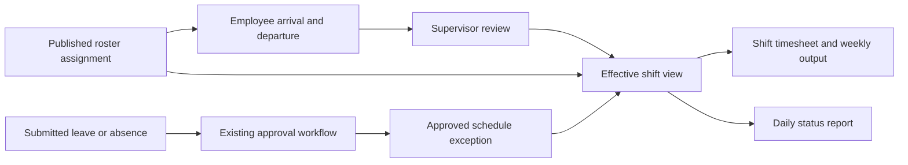

# GAA HR end-to-end alignment

**Status:** Active implementation and verification plan, 2026-09-28. GAA is the
client organisation; GMS is its meteorological department. This plan records
user instructions and verified code gaps, not institutional policy approval or
deployed behaviour. It supplements [ADR-0009](../adr/0009-gaa-staff-platform.md)
and the [platform plan](../exec-plans/gaa-modular-monolith-implementation.md).

## Confirmed working requirements

- Verify each HR journey from frontend input through FastAPI, persistence,
  approval, reads, and PDF output before calling it complete.
- Python/FastAPI owns PDF generation. Preview and signed output use the same
  renderer; submitted documents preserve the employee, reporter, supervisor,
  department, form values, signature, and submission timestamp snapshot.
- Compare each form with its original in `temp-files/gaaforms/`. Preserve
  required content and final output structure; the interactive UI can be modern.
  Use [the inventory](forms-inventory.md) as a starting map, not proof of parity.
- Prefill authenticated employee identity, department, supervisor, roster shift,
  dates, and available profile details. Persist editable values across draft
  save/reopen. The server resolves identity and checks scope independently.
- Staff records arrival and departure against the scheduled shift; a supervisor
  approves each completed employee shift. Employees propose missing-time or other
  corrections with a reason; preserve original values and require supervisor
  review. Record break duration per shift initially; compensation treatment is
  separate. Future clock hardware must feed this same
  attendance journey rather than create another timesheet system.
- GAA reporting weeks run Sunday through Saturday. A shift belongs to the week
  of its local start date: a Saturday night shift remains in that week when it
  ends on Sunday. Do not split it solely because midnight crosses the boundary.
- Timesheets and daily status reports are completed per M, E, and N shift. D
  coverage appears in M/E reporting; retain the actual D roster assignment.
  Everyone, including D staff, records their own arrival/departure. M/E reports
  reference the same D attendance for arrival/departure coverage; one attendance
  record counts hours once and the supervisor gives final approval. Do not split
  or duplicate D hours across reports or infer pay allocation.
- An absentee reporter submits; the supervisor approves. Approved sickness and
  other absences must appear consistently in roster, timesheet, and status
  views. Reporting another employee remains subject to existing scoped access.

## Schedule, attendance, and absence ownership

The roster is authoritative for scheduled work. Preserve its original shift
assignment and apply approved leave, absence, and exchange changes with source
references and history. Attendance records actual arrival/departure; a scheduled
shift alone does not establish that an employee attended. Pending reports remain
visible as pending and cannot silently become approved time or approved absence.

Reuse the existing approval engine and audit registration. Updates and their
source links must commit together; repeated approvals cannot duplicate effects.
Cancellation or correction must reverse the approved effect while preserving
history. Do not infer pay, overtime, leave units, or sick-leave debit rules from
hours or an absence label: unresolved rules remain in [the policy register](policy-rules.md).

## Delivery order and current evidence

| Slice | Current evidence / gap | Completion evidence |
| --- | --- | --- |
| Leave | Local changes add Python preview, shared signed renderer, resolved names/dates, additional original fields, validation and API error details. Live host browser acceptance remains outstanding. | Draft save/reopen, submit, approval/return/re-sign, immutable signed PDF, original comparison, access denial and roster effects. |
| Absentee | Local changes add Python preview/shared signed rendering, reporter/subject draft restoration, inferred roster shift, paired local times, submission validation and scope checks. Approved absence/leave markers now project into roster/grid/calendar and linked timesheet API entries without overwriting scheduled shifts or hours. API approval/overnight/pending/rejected/cancelled checks pass; daily status propagation and host browser acceptance remain outstanding. | Reporter and subject remain distinct; supervisor approval; approved absence reflected in effective roster, timesheet and status; pending/rejected/cancelled cases tested. |
| Shift exchange | Existing form and approval routes; verify both staff agreement, draft persistence, conflicts and approved roster effect. | One approved exchange updates the intended assignments once; rejected/returned exchanges do not alter work. Python preview matches saved output. |
| Attendance and timesheet | Timesheet rows store supplied hours with optional roster links; no dedicated arrival/departure event history. Displayed name/period and computed API date range need alignment. | Roster-prefilled arrival/departure, supervisor review, correction history, no duplicate punches, overnight and Sunday–Saturday boundary tests, original final output. |
| Daily status | Current UI uses AM/PM and does not submit structured attendance entries; align with M/E/N and D coverage. | Shift-prefilled staffing, approved absence and actual attendance agree with timesheet; reporter can complete operational notes and submit for review. |
| Parking | Backend permit lifecycle exists; current browser surface primarily shows expiry. | Original vehicle-pass application fields, draft/submission/review/issue/renewal and expiry verified with correct access. |
| Profile, setup, roster, workflow, documents, training | Existing routes and components require complete journey checks, beyond component-level success. | Scoped CRUD/read/export, accurate prefills, validation, approval transitions, attachments, immutable documents and dashboard agreement. |

The hardware presence-token proposal in ADR-0009 is future work. Manual arrival
and departure is the current requested first step; no device integration or
automatic payroll is claimed by this plan.

## Parallel delivery coordination

Attendance/timesheet, daily status and shift exchange are being implemented in
separate worktrees. Integrate their shared workflow, signature and API contract
changes together; regenerate OpenAPI/client after integration and verify the
combined journeys. Scheduled staffing is unconfirmed attendance until actual
arrival/departure is recorded. Approved exceptions expose status, never sensitive
absence reasons, on department roster/calendar feeds.

The next queued reviews are leave accounting/reversal and signature revisions;
staff onboarding/service dates/probation/supervisor and scope; and parking,
documents/training lifecycle. Policy-register decisions and HR opening-balance
evidence remain prerequisites only for calculations that depend on them. Full
authenticated browser acceptance remains outstanding while host port 3001 is
unavailable. No deployment or paper-process retirement is claimed.

## Verification per slice

1. Compare original fields and instructions; separate confirmed requirements
   from unresolved source-policy interpretations.
2. Test FastAPI validation, record scope, persistence, approval transitions,
   retry behaviour and related record effects against a disposable database.
3. Test frontend prefill, edit/save/reopen, error messages and PDF transport.
   Regenerate OpenAPI/client and verify drift when the contract changes.
4. Inspect the generated PDF visually and check its stored snapshot; verify
   access and that preview creates no submitted or signed record.
5. Exercise the complete authenticated journey in the host web application.
   Component/API tests alone do not establish that a browser journey works.
6. Run repository formatting, type checks and affected-layer gates. Record
   remaining limitations; deployment and institutional acceptance stay separate.

The supplied access logs show two leave-create HTTP 400 responses. They omit
the response detail and request payload, so they do not establish the exact
cause. The UI must expose FastAPI's expected validation detail so the next
attempt produces actionable evidence.
