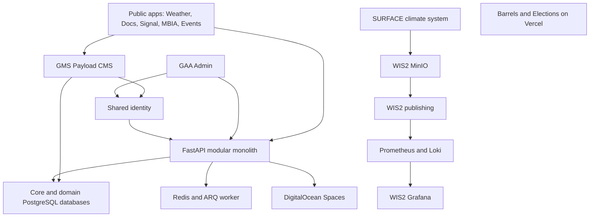

# Repository integration audit — 3 October 2026

**Status:** Architecture and configuration audit; operational limits recorded below
**Owner:** Barrels Grenada engineering

## Assessment

The repository has a coherent application core, but it is not yet one fully
verified operational platform. The largest gaps are integration activation,
cross-stack visibility, release continuity and accurate operational inventories.
Consolidating all databases or deploying every tool together would not solve them.

This review covers the application/workspace inventory, shared packages, FastAPI
contracts, local and deployed configuration wiring, CI/CD, storage, weather
tooling, monitoring, backups and documentation. It is not a line-by-line security
audit, a provider-account audit or a test of every authenticated business journey.
No credential values are reproduced and no environment files were modified.

## System map

Arrows describe implemented boundaries, not proof that every deployment is
configured. Signal, Events and Elections currently have static/prototype paths;
they do not all consume the API or CMS. CMS media uses its own persistent volume.

## What is integrated

| Surface | Evidence | Assessment |
| --- | --- | --- |
| Web applications | Ten app directories; shared pnpm catalog, UI/theme/auth packages and TypeScript checks | Consistent build foundation; Barrels is independently hosted static content |
| API contracts | FastAPI has 243 schema paths / 294 operations; generated client and code/spec comparisons passed | Strong shared contract; static coverage is not journey coverage |
| Identity | Auth, GAA Admin, delegated public apps and GMS CMS use the shared FastAPI identity boundary | Shared login exists; permissions remain app/domain-specific |
| Business data | Main database plus WxWatch, WxProducts, eRegister, Janitorial and Transport migrations are owned by FastAPI | Separate domains are intentional; avoid direct database access from readers |
| Editorial content | GMS has a dedicated Payload database and public feeds | Signal CMS is explicitly deferred; Signal still uses repository MDX |
| Async operations | Redis/ARQ worker, CAP outbox and notification infrastructure | Deployed worker passed its health check; not all delivery paths exercised |
| Core storage | FastAPI S3-compatible adapter; deployed Spaces secret names wired into STORAGE variables | No evidence that WIS2 MinIO is the application's upload store |
| Weather publishing | SURFACE → WIS2 incoming MinIO bucket documented in ADR-0010 | Separate upstream lifecycle; operational acceptance remains separate |
| CI/CD | Lint, types, tests, contract drift, image scans, migrations and external smoke gates | Strong automation; deployment still has observable service interruption |
| Backups | Core database inventory includes eRegister; weather backup tooling covers stores/configuration | Tooling coverage exists; recent complete restore evidence is still required |

## Grafana, MinIO and the other infrastructure

Grafana is provisioned by `wis2box/docker-compose.monitoring.yml`, with Loki and
Prometheus data sources. Prometheus targets MinIO, MQTT metrics, cAdvisor and
Elasticsearch exporter. Its configuration does not provide repo-wide FastAPI,
Next.js, ARQ or database service dashboards. A configured scrape target is not
proof that the target is currently running or reachable.

MinIO belongs to WIS2: it stores incoming/publication objects. FastAPI uploads
use a separate S3-compatible adapter configured for Spaces in staging. These
stores have different owners and recovery requirements; retain that distinction.

SURFACE also has its own PostgreSQL, Redis, Memcached and Celery workers. Those
are upstream application dependencies, not redundant replacements for the core
PostgreSQL/ARQ stack. Elasticsearch and Mosquitto serve WIS2 publishing. Adminer
and Mailpit are local development tools, not public product applications.

The core staging pipeline does not deploy SURFACE/WIS2/Grafana/MinIO or the
independent Barrels/Elections Vercel apps. Weather has separate deployment and
backup workflows requiring reviewed host configuration and credentials.

## Prioritized findings

| Priority | Finding | Evidence and next action |
| --- | --- | --- |
| High | Existing GA4 was disconnected during the telemetry migration | New provider ignored legacy keys while every analytics mapping was empty. Restore the known staging Weather property explicitly; assign other destinations without claiming provider verification |
| High | Staging replacement interrupts all routes | All eight web roots and API readiness briefly returned proxy 404 during run 37131928180, then deployment smoke passed. Measure the outage and improve replacement/readiness sequencing before relying on uninterrupted service |
| High | Production inputs are incomplete | Production lacks required FastAPI/eRegister/CMS database passwords, Payload secret and core image/private-IP variables. Resolve host-specific configuration before production promotion |
| High | Collector ingestion is disconnected in staging configuration | WXWATCH_INGEST_TOKEN is absent from visible staging/repository secrets; local API and collector tokens do match. Provision staging-specific integration before claiming collector-to-gallery coverage |
| Medium | No complete cross-stack operational catalogue | Existing catalogue covers app/provider telemetry but does not inventory SURFACE, WIS2, MinIO and Grafana as first-class operational services. Extend inventory before choosing a central dashboard |
| Medium | Optional integrations have no delivery evidence | OAuth, Resend, Sentry and Spaces names are present; actual sign-in, delivery, source maps, uploads and recovery need representative functional checks |
| Medium | Billing and webhook configuration are incomplete | Staging has no Stripe bundle, Resend webhook secret or email renderer secret. Treat these capabilities as unavailable until their intended consumers/configuration are established |
| Medium | Local status command covers only core projects | Owner's pnpm status showed only Redis. It cannot establish the state of SURFACE/WIS2; add a read-only consolidated status view rather than an unconditional start-everything command |
| Medium | Documentation and diagnostics drift | Stack-doctor expects obsolete pnpm 10 while the manifest requires 12.3.4; port docs call CMS local-only and Elections undeployed; delivery map contains an obsolete workflow count |
| Medium | Multi-organization platform is not implemented | ADR-0014 is proposed; shared authentication does not supply organization/workspace isolation. Do not expose client data to all products as an integration shortcut |
| Low | Retired directory residue can confuse inventory | apps/api/honoapi exists locally but has no tracked files and is outside the pnpm workspace. The active backend is FastAPI, with the documented Payload exception |

## Staging evidence

[Staging pipeline 37131928180](https://github.com/Marcus100/grenmet/actions/runs/37131928180)
completed successfully at revision `337b35e49f82211098d69012b365b6da4ef9703c`.
Its deployment logs report healthy database, Redis, API, worker, proxy and all
eight core web containers. External functional smoke passed at 15:19 UTC,
checking API readiness, CAP, products, CMS public home, CMS sign-in destination
and public page rendering. This supersedes the earlier in-deployment 404 sample.

Barrels and Elections responded HTTP 200 on their Vercel domains during this
audit. Their provider settings and authenticated account configuration were not
inspected. Weather-stack runtime status is unverified, not implicitly covered by
the core staging result. Analytics continuity changes made during this review
are not part of the above deployed revision.

## Recommended path to one coherent platform

1. Keep one service inventory recording owner, app/domain, runtime, environment,
   URL, dependencies, credentials by name, storage, health, backup and last
   functional verification. Include independently deployed systems.
2. Preserve working integrations during migrations. Track configured, running
   and delivery-verified separately; never replace active settings with empty
   mappings as a side effect of an architectural cleanup.
3. Provide one read-only operator status report across core, weather and Vercel,
   while retaining independent start/deploy/upgrade controls.
4. Complete staging journeys: sign-in → authorized Admin/CMS, content publishing
   → public reader, upload → retrieval, collector → API → gallery, queued action
   → delivery, and backup → isolated restore.
5. Decide monitoring roles explicitly: Sentry for application errors, product
   analytics for usage, availability probes for uptime, and Grafana for the
   weather metrics it already owns. Expand dashboards only for measured gaps.
6. Keep shared infrastructure and contracts; retain client/product permissions,
   database ownership and upstream upgrade boundaries. No new microservices or
   additional monitoring product is justified merely to unify the repository.

## References

- [Repository delivery map](../portfolio/repository-delivery-map.md)
- [Storage and recovery inventory](storage-delivery.md)
- [Analytics and monitoring](analytics-monitoring.md)
- [Release runbook](release-runbook.md)
- [WIS2 publishing runbook](wis2-publishing-runbook.md)
- [Platform direction, ADR-0014](../adr/0014-barrels-platform-core-direction.md)
- [Vendored applications](../../VENDORED.md)
