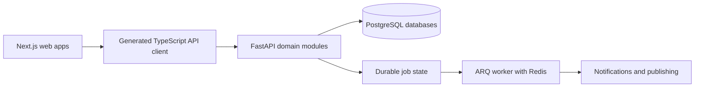

# Technical Overview

**Status:** Active reference  
**Owner:** Barrels Grenada engineering  
**Last updated:** 2026-10-05

This document explains how the Barrels Grenada codebase fits together: the
relationships among applications, shared packages, authentication, and data.
The repository hosts Barrels products and client delivery. GAA is the client
organisation and GMS is its meteorological department; neither is a Barrels
product. Barrels Grenada owns the software and licenses it to GAA; GAA owns its
data and client documents (see the [IP boundary](./strategy/barrels-ip-boundary.md)).

For ownership and planning, see the [Portfolio Planning System](./portfolio/).
For GMS service design, see [GMS Digital Service Architecture](./architecture.md).
For commands and setup, see the [root README](../README.md).

## Monorepo structure

Most web apps use Next.js 16 and React 19. Operational business logic lives in
one Python 3.14 FastAPI application, organised into domain modules: a modular
monolith. Web apps consume API contracts rather than accessing operational
databases themselves.



This is the operational request path. Public content sites also render local
MDX or checked data files. Payload CMS is the deliberate TypeScript-backend
exception: it owns editorial content and its own PostgreSQL database. The
Barrels company homepage is plain HTML/CSS.

**JavaScript workspace:** pnpm manages apps and shared packages; Turborepo
orders and caches package tasks such as `pnpm build` and `pnpm type-check`.
Shared dependency versions live in `pnpm-workspace.yaml` under `catalog:`;
consumers reference them with values such as `"react": "catalog:"`.

**Python workspace:** uv manages FastAPI, collectors, and research tools through
the root `pyproject.toml` and `uv.lock`. Select a member with
`uv run --frozen --package <name> ...`. Python tasks are not pnpm workspace packages.

See [Workspace Layout](../README.md#workspace-layout) for directories and
[Development](./web/development.md) for the web workflow.

## The web apps at a glance

Ports below follow the canonical [port map](./ports.md). Package names for
Next.js apps follow `@barrelsgd/web-<app>`.

| App | Port | Audience and purpose | Current data and authentication |
| --- | --- | --- | --- |
| `auth` | 3000 | Shared staff sign-in and account interface | FastAPI identity and browser sessions |
| `gaa-admin` | 3001 | GAA staff portal, piloted in GMS | Built-in sign-in; FastAPI contracts for operational modules; Salesbus still uses mock data |
| `docs` | 3002 | Public GMS preparedness and documentation | Local MDX; public pages |
| `gms` | 3003 | Public GMS weather service | Public FastAPI weather products and CMS content |
| `signal` | 3004 | Barrels news and entertainment | Local editorial MDX; public reader |
| `mbia` | 3005 | Public airport information | Local content; public pages |
| `cms` | 3006 | GMS editorial content management | Payload CMS, dedicated database, shared FastAPI identity |
| `elections` | 3007 | Barrels election coverage and civic education | Checked source data, derived records, and local editorial content; public pages |
| `events` | 3009 | Barrels event discovery, community, and organiser console | FastAPI listings/community and app-scoped email-code sign-in; sales/settlement overview remains a labelled demo |
| `barrels` | — | Barrels Grenada company homepage | Static HTML/CSS; separate build, no Next.js dev port |

### Consolidated staff portal

The former `cap`, `hr`, `wxwatch`, `wxproducts`, and `salesbus` apps now live
inside `gaa-admin` at `/cap`, `/hr`, `/wxwatch`, `/wxproducts`, and `/salesbus`.
The shared admin layout authenticates these routes. The old standalone
subdomains are retired; they are not separate apps to start locally.

Weather domains retain separate databases owned by FastAPI. HR and CAP use the
main application database. Salesbus remains a prototype using mock data; its
presence in the portal does not make it a GAA product. See the
[portal guide](../apps/web/gaa-admin/AGENTS.md) for module boundaries.

### Events implementation status

The public/community UI and `/dash/events` organiser editor read FastAPI through
[the web data layer](../apps/web/events/src/data/events-api.ts). Server actions
persist listings, RSVPs, saves, profiles, group membership, connections and messages.
The `/dash` sales and settlement overview remains explicitly labelled demo data;
ticket payments, admission and settlement are not implemented by this integration.

The [FastAPI Events domain](../apps/api/fastapi/src/events/AGENTS.md) already
contains listings, groups, connections, messaging, and access rules, with its
own database and Alembic history. The web UI uses app-scoped email-code sign-in
and a host-only session cookie. Events database configuration remains optional
for the wider stack, but is required for the Events website's data-backed pages;
those routes are unavailable while `EVENTS_DATABASE_URL` is unset. This inventory describes
source implementation, not deployment or operational acceptance.

## Auth architecture

FastAPI owns identity, sessions, and permission enforcement. A sign-in UI and a
backend identity service are different responsibilities: `web-auth` is one UI,
while `gaa-admin` has its own sign-in pages. Public reading does not require a
staff session.

### Staff sessions

`auth` and `gaa-admin` use `@barrelsgd/auth/server` to create and exchange
sessions. `gaa-admin` reads the cookie in its admin layout and redirects to its
own `/signin` when authentication is missing or invalid. Payload CMS also
integrates with FastAPI identity; see the [CMS guide](../apps/web/cms/README.md).

The shared package exports `buildSharedSignInUrl()` for apps that delegate
sign-in to `web-auth`. Do not infer that a public page requires authentication
from an `AUTH_API_URL` setting: GMS also uses that API base URL to fetch public
weather products.

### The session cookie

Each app keeps its own **host-only, httpOnly, SameSite=Lax** session cookie
(`auth_session`, `admin_session`, `cms_session`, `events_session`) holding an
opaque session token; apps sign in through auth.barrels.gd by single sign-on
handoff (ADR-0017). Server code calls
`exchangeSessionForAccessToken()` to obtain a short-lived access token and the
user record, then sends the access token with authenticated FastAPI requests.

```text
Browser sends session cookie
  → Next.js reads it on the server
  → FastAPI exchanges the session for an access token and user
  → Next.js calls the operational API with that access token
  → FastAPI checks permissions and returns the allowed data
```

The sign-in app writes the cookie with `writeSessionCookie()`. GAA Admin's
server wrappers use React `cache()` to reuse cookie reads and session exchanges
within a render. UI gating complements, but never replaces, API permission
checks. See the [auth package reference](../packages/auth/README.md).

### App-scoped product sessions

Events uses the backend model introduced by
[ADR-0016](./adr/0016-app-scoped-accounts-and-sessions.md): accounts are shared,
but app sessions and permissions are separate. Authenticated Events requests
require Events access tokens; staff routes reject app-scoped tokens, and Events
routes reject supplied staff tokens. Public Events reads can be anonymous. The Events
browser cookie is host-only `events_session`; server-side session exchange keeps
access tokens out of browser code.

## Shared packages

| Package | Responsibility |
| --- | --- |
| `@barrelsgd/api-client` | Kubb-generated TypeScript types, fetch clients, React Query hooks, and Zod schemas from FastAPI OpenAPI |
| `@barrelsgd/auth` | Client user context and server-side session, cookie, API, and redirect helpers |
| `@barrelsgd/ui` | Brand-neutral primitives built on Base UI with shadcn-style patterns |
| `@barrelsgd/gms` | GMS logo, foundation styles, product metadata, and service-specific presentation |
| `@barrelsgd/theme` | Shared display preferences and theme utilities |
| `@barrelsgd/email-templates` | Shared React Email templates |
| `@barrelsgd/cms-migrations` | Runtime dependencies for CMS migrations |
| `@barrelsgd/tsconfig` | Shared TypeScript and Next.js configuration presets |

Product and client presentation packages may depend on shared UI; shared UI
must not depend on a brand package. Use per-component imports such as
`@barrelsgd/ui/components/ui/button`, with `cn` from
`@barrelsgd/ui/lib/utils`.

**Never edit `packages/api-client/src/gen/` directly.** Change FastAPI, regenerate
`openapi.json`, then run `pnpm generate:api-client` and `pnpm check:drift`.
Commit the schema and generated client together. See
[Generated files](../CONTRIBUTING.md#generated-files) for the commands.

Server Components fetch initial server-renderable data. Generated React Query
hooks serve client mutations and polling where needed; their availability does
not require every page to fetch on the client.

## Database architecture

| Boundary | Owner and schema workflow |
| --- | --- |
| Main application database: identity, HR, CAP, and platform records | FastAPI SQLAlchemy models and main Alembic history |
| WxWatch, WxProducts, eRegister, Janitorial, Transport, and Events databases | FastAPI domain sessions and each domain's own Alembic history |
| Editorial CMS database | Payload collections and CMS migrations |

GAA Admin has no operational database access. FastAPI owns operational schema
changes, catalogue seeds, reads, and writes. Its domain modules generally split
responsibilities into `router.py` (HTTP), `service.py` (business rules),
`models.py` (SQLAlchemy tables), and `schemas.py` (Pydantic API shapes).

The API also hosts [audit and notifications](./api/contracts.md#change-history-and-notifications-platform-core).
The [ARQ worker](../apps/api/fastapi/src/worker/AGENTS.md) handles scheduled CAP
publishing, feed ingestion, and notification delivery using Redis. Durable job
state lives in the database so retries do not rely on Redis alone.

Collectors under `scripts/` and the independent SURFACE and wis2box stacks are
additional operational systems; they are not Next.js apps or FastAPI domain
databases. See [VENDORED.md](../VENDORED.md) and
[Data Architecture](./data-architecture.md) for those boundaries.

## React Compiler

React Compiler is enabled in the Next.js configs for `auth`, `gaa-admin`,
`docs`, `gms`, `elections`, and `events`. Check the target app's config rather
than assuming every site uses it. In compiler-enabled apps, follow the Rules of
Hooks and avoid adding `useMemo`/`useCallback` solely for routine memoization.

## Request flow: the HR dashboard

Use this existing feature to trace one request across the repository:

1. **Page and auth boundary.** The browser requests `/hr` in GAA Admin. Its
   `src/app/(admin)/layout.tsx` reads and exchanges the session cookie, redirects
   unauthenticated users to `/signin`, and renders the shared application shell.
2. **Server-side data loading.** `src/app/(admin)/hr/page.tsx` calls
   [`loadDashboard()`](../apps/web/gaa-admin/src/components/hr/dashboard/load-dashboard.ts).
   The loader gets the access token and calls generated `hrGetHrDashboard()`
   with an authenticated client, no-store caching, and a request timeout.
3. **HTTP boundary.** The [dashboard router](../apps/api/fastapi/src/hr/dashboard/router.py)
   handles `GET /api/v1/hr/dashboard`. `CurrentUser` and `SessionDep` supply the
   authenticated user and database session.
4. **Business rules and queries.** The [dashboard service](../apps/api/fastapi/src/hr/dashboard/service.py)
   reads requests, leave balance, roster, and approvals, applying user and
   department access rules. These rules live in Python, not in the page.
5. **Response and rendering.** `HrDashboardPublic` defines the response shape.
   Its generated TypeScript counterpart is consumed by the page, which renders
   `HrDashboard`. Unexpected loading errors reach the app error boundary and
   reporting path.

For a hands-on source search, run from the repository root:

```bash
rg -n 'loadDashboard|hrGetHrDashboard|def read_dashboard' apps/web/gaa-admin/src apps/api/fastapi/src/hr
```

When changing a similar feature, follow the
[full-stack playbook](./playbooks/full-stack-feature.md) and read each affected
directory's `AGENTS.md` before editing.

## Environment variables

Use the target app's environment example and [environment reference](./env.md)
for local setup; do not assume every static site needs an environment file.
Never commit local environment files or credentials.

Next.js application code reads validated environment modules (usually
`src/env.ts`; some public apps use `src/lib/env.ts`). Keep raw `process.env`
access at the configuration boundary. FastAPI uses its Python settings modules.
Run Docker services and web dev servers on the host; use the devcontainer for
agent editing, formatting, type-checking, and tests.

## Where to go next

| I want to… | Read… |
| --- | --- |
| Run or build the project | [root README — Scripts](../README.md#scripts) |
| Work on a specific app | That app's `AGENTS.md` in `apps/web/<app>/` |
| Change a feature across API and UI | [Full-stack feature playbook](./playbooks/full-stack-feature.md) |
| Use the shared auth package | [Auth reference](../packages/auth/README.md) |
| Use shared UI components | [UI reference](../packages/ui/README.md) |
| Understand app-scoped accounts | [ADR-0016](./adr/0016-app-scoped-accounts-and-sessions.md) |
| Set up environment variables | [Environment reference](./env.md) |
| Understand the design system | [Design system](./design-system.md) |
| Deploy to staging or production | [Deployment guide](./deployment.md) |
| Debug something broken | [Troubleshooting](./troubleshooting.md) |
| Understand GMS service design | [GMS architecture](./architecture.md) |
